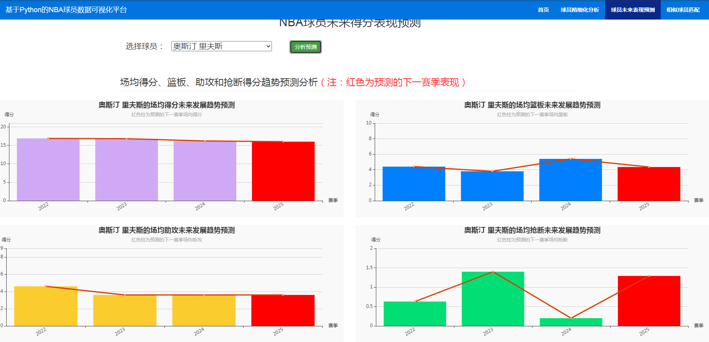

## 计算机毕业设计Python职业篮球运动员数据分析可视化 NBA分析可视化 篮球可视化 大数据毕业设计(源码+LW文档+PPT+讲解)

## 要求
### 源码有偿！一套(论文 PPT 源码+sql脚本+教程)

### 
### 加好友前帮忙start一下，并备注github有偿26球员分析预测
### 我的QQ号是1957722142 或者 2827724252或者798059319或者 1679232425
### 或者微信:biyesheji1698 或者 bysj2023nb

# 

### 加qq好友说明（被部分 网友整得心力交瘁）：
    1.加好友务必按照格式备注
    2.避免浪费各自的时间！
    3.当“客服”不容易，repo 主是体面人，不爆粗，性格好，文明人。
## 开题报告

```


论文（设计）选题	基于Python职业篮球运动员数据的分析与可视化
题目类型	理论研究论文 应用研究论文 艺术设计（创作）
工程设计     程序设计     其他
选题来源	校外立项项目	                           	
学校自选项目		                        	
非立项      其他	                     	                                 
论文类型	毕业论文  毕业设计   涉密论文  其他
选题依据（综述国内外有关本选题的研究动态，即文献梳理；说明本选题的理论价值和实际意义）： 

随着体育产业的发展，体育领域的数据研究也成为了一个热门的探讨话题，对于运动员的数据分析也深得人们探讨。职业篮球作为一项极具观赏性和商业价值的运动，其运动员数据蕴含着巨大的价值。运用Python进行数据分析与可视化，可以深入挖掘篮球运动员的技术特点、比赛表现以及发展趋势，更高效地解析运动员的表现，为教练团队和球队管理提供科学依据，为球队管理、战术制定、运动员训练以及球迷观赛提供新的视角和决策支持。因此，本选题旨在通过Python技术，对职业篮球运动员的数据进行深入挖掘，以发现影响比赛表现的关键因素，为提升运动员竞技水平提供数据支持。
一、国内外研究现状
1.国外研究现状
国外对体育数据分析的研究起步较早，篮球数据分析已经成为体育科研的重要组成部分，美国NBA联赛中，众多球队已经开始运用数据分析技术，如球员效率值（PER）、真实投篮命中率（TS%）等指标，对球员表现进行量化评估。在篮球领域，早在20世纪90年代，就开始利用数据分析来评估球员的表现和球队战术。国外研究主要体现在；
①球员职业生涯与竞技状态的长期分析
2022年刘玉豪等通过NBA球员20年职业生涯数据如得分、篮板、失误率的纵向统计，发现“30岁后竞技状态呈非线性下降”规律，研究中虽未明确使用Python，但隐含了时间序列分析的需求[8]。2023年赵祎凡等对NBA选秀球员的体能测试数据如垂直弹跳、折返跑时间进行标准化处理，通过TSA指标量化评估了球员的潜力，此类分析可通过Python的Scikit-learn库实现特征工程与模型训练[26]。
②数据驱动的联赛战略与文化研究
2023 年朱从庆指出，NBA 的全球化扩张依赖 “数据驱动的市场定位”，例如通过观众地域分布数据调整赛事转播策略，此类分析需借助 Python 的地理信息可视化工具（如 Folium）[27]。2023 年陈埭玮研究 NBA 联赛文化生成路径时，通过社交媒体互动数据（如推文、点赞量）分析球迷偏好，Python 的文本挖掘库（如 NLTK）可用于情感分析与主题建模 [28]。
③教练与管理的量化决策
2022 年蔡剑龙分析 NBA 传奇教练菲尔・杰克逊的执教特征时，统计其战术（如三角进攻）的使用率与胜率相关性，若结合 Python 的热图（Heatmap）可视化，可更直观展示战术与胜负的关联 [29]。2022 年安旭泽对比 NBA 与 CBA 的内部制衡机制（如工资帽、选秀权分配）时，通过 Python 的箱线图（Boxplot）清晰呈现两者在资源分配上的差异 [30]。近年来，随着数据采集技术的进步，研究更加深入，如利用球员追踪数据来分析球员的跑动轨迹和战术配合。此外，机器学习等先进技术也被应用于篮球数据分析，如预测比赛结果、球员伤病等。
2.国内研究现状
在国内，对体育数据分析的研究起步相对较晚，但近年来也开始注重并发展起来。在篮球领域，研究主要集中在球员技术统计、比赛数据分析等方面。
①数据驱动的赛事与训练分析
2022 年刘炳泉指出，大数据技术已渗透至 CBA 赛事的战术复盘、观众行为分析等环节，但未明确提及具体数据分析工具 [7]。2022 年刘孟璠强调高水平运动队需加强数据整理与运用，但仅停留在 “数据记录” 层面，未涉及可视化或建模 [10]。2017 年赵述强等构建职业篮球运动员体能指标体系（如力量、速度、耐力），但数据验证依赖传统统计方法，缺乏动态可视化展示 [16]。
②人才输送与转会机制的量化研究
2022 年黄亚男等通过对比高校联赛（CUBA）与职业联赛（CBA）的人才输送数据，发现高校向职业联赛的输送率不足 10%，但仅通过表格呈现结果，未借助可视化工具直观展示输送路径 [9]。2023 年崔佳琦分析职业篮球运动员转会的利益博弈时，虽涉及转会费、合同年限等数据，但未对关键变量（如年龄、竞技状态）进行相关性分析 [4]。
③制度与权益的数据分析
2025 年陈传亮等研究 CBA 球员聘用合同的法律性质时，通过统计合同期限、薪资结构等数据，论证其 “特殊劳动关系” 属性，但数据呈现方式单一 [1]。2021 年陆广探讨我国职业篮球运动员协会构建时，参考 NBA 球员工会（NBPA）的运行数据（如谈判成功率、福利覆盖范围），但未对数据进行可视化对比 [12]。
总体而言，国内研究聚焦于职业篮球（以CBA为主）的实践问题，数据应用多围绕赛事影响、人才输送、体能评估、制度优化等方向展开，技术手段以描述性统计为主，Python等工具的深度应用仍处于探索阶段。国外在职业篮球数据分析领域已形成较为成熟的理论体系和技术应用，而国内研究尚处于起步阶段，尤其在数据可视化和预测模型方面有待进一步发展。
二、理论价值和实际意义
1.理论价值
本研究利用Python对职业篮球运动员数据进行深入分析与可视化，有助于球队管理层更好地了解运动员的表现，制定合理的战术和训练计划，还有助于运动员本人通过数据分析，针对性地提升自己的技能。理论上，可以丰富体育数据分析的方法论，推动体育数据科学的发展。实践上，可以为球队管理层提供科学决策依据，优化战术安排和运动员选拔；为教练团队提供针对性的训练方案，提升运动员竞技水平；为广大球迷提供更直观、深入的比赛解读，增强观赛体验。此外，本研究对于体育数据分析行业的发展也具有一定的推动作用，有助于提升体育产业的科技含量。
2.实际意义
随着信息技术的飞速发展，数据已经成为各个领域重要的生产要素。在体育领域，尤其是竞技体育，数据的重要性日益凸显。职业篮球作为一项全球性的体育运动，其比赛过程和运动员表现产生了海量的数据。如何有效地收集、处理、分析和可视化这些数据，已经成为体育数据分析领域的研究热点。Python作为一种强大的编程语言，在数据分析、机器学习和可视化方面具有显著的优势，被广泛应用于各个领域。本研究将聚焦于利用Python对职业篮球运动员数据进行深入分析与可视化，旨在挖掘数据背后的价值，为篮球运动的发展提供新的视角和决策支持。
选题的主要研究内容： 
1. 数据收集
（1）确定数据来源：从NBA官网、CBA官网、第三方数据平台（如虎扑,Basketball-Reference, ESPN）以及公开数据集（如Kaggle）收集职业篮球运动员的相关数据。
（2）确定数据类型：职业篮球运动员数据主要包含以下几个方面：
基本信息： 包括运动员的姓名、年龄、身高、体重、位置、球队等。
技术统计：这是数据的核心部分，包括得分、篮板、助攻、抢断、盖帽、失误、犯规、投篮命中率、三分命中率、罚球命中率等。这些数据又可以分为总数、场均、每分钟等指标。
比赛数据：包括比赛时间、对手、比赛地点、比赛结果等。
高级数据：随着数据分析的发展，一些高级数据指标被提出，如球员效率值 (PER)、真实命中率 (TS%)、胜负值 (Win Shares)、正负值 (+/-) 等，这些指标能够更全面地评估球员的综合能力和对球队的贡献。
追踪数据：近年来，一些职业联赛建立了球员追踪系统，可以实时采集球员在场上的位置、速度、加速度等数据，为深入分析球员的跑动轨迹、战术配合提供了新的数据来源。
2. 数据清理与预处理
（1）处理缺失值：对收集到的数据进行检查，识别并处理缺失值。比如采用填充（如均值填充、中位数填充等）或删除缺失值记录等方法，确保数据的完整性和可用性。
（2）数据标准化：将不同尺度的数值型数据转换为统一范围或分布，避免因量纲差异导致模型偏差（如年龄、身高、得分等指标的单位不同），通过标准化使其在同一尺度下，以便后续的数据分析和模型构建。
（3）数据编码：对于一些分类变量进行适当的编码，将分类变量（如球员位置、球队名称、合同状态等）转换为数值型数据，便于算法处理,以便能够在数据分析和可视化工具中进行使用。
3.数据分析
（1）描述性统计分析：利用Python的Pandas库，对运动员的基本信息、技术统计、比赛数据进行描述性统计分析，如计算均值、标准差、最大值、最小值等，初步了解运动员的整体表现。
（2）相关性分析:量化分析职业篮球运动员各项技术指标之间的关联程度，识别影响比赛表现的关键因素。如分析 “三分命中率” 与 “场均得分” 的相关性，判断外线投射对球员表现的影响；探究 “出场时间” 与 “失误率” 的关联性，识别疲劳对球员稳定性的影响阈值等。
（3）时间序列分析:挖掘职业篮球运动员数据在时间维度上的规律，如职业生涯周期内的表现波动、赛季内的状态变化趋势。通过 Python 的statsmodels库进行时间序列分解，识别 “年龄增长导致的竞技状态下降” 等长期趋势（如刘玉豪等研究发现的 “30 岁后状态非线性下降” 规律 [8]）。
（4）回归分析:构建统计模型评估各因素对球员表现的影响程度，识别关键驱动因素。
（5）机器学习模型:使用K-means 聚类算法或层次聚类，对球员技术指标（如得分、助攻、抢断、盖帽等）进行降维分组。，以对具有相似特征的产量数据进行集合。
（6）构建预测模型：根据数据分析结果，可以尝试构建简单的预测模型，如线性回归模型等，以预测预测球员下赛季的场均得分（如根据前 3 赛季数据建立趋势外推模型）。
4.数据可视化
（1）选择合适的可视化工具：可以使用 Python 中的可视化库，如 Matplotlib、Seaborn 等。
（2）绘制基础图表：绘制直方图展示球员年龄分布，用箱线图对比不同位置球员的篮板数据差异等。
（3）可视化相关性：动态折线图展示球员赛季得分趋势，桑基图可视化球员转会路径等。

拟采用的研究方法：

1.文献研究法:文献研究法是指通过查阅、分析、整理有关文献资料，全面、正确地研究某一问题的方法。它是一种基于已有研究成果和理论基础的研究手段，能够帮助研究者了解研究领域的现状、发展趋势以及存在的问题。
①查阅国内外相关文献: 通过查阅国内外关于职业篮球运动员数据分析与可视化的相关文献，了解当前研究现状、技术手段、指标体系等，为本研究的开展提供理论基础和参考。
②数据源调研: 调研并确定可靠的数据来源，包括官方网站、第三方数据平台、公开数据集等，为数据获取提供保障。
③技术选型调研: 调研Python生态系统中适用于数据分析与可视化的库，如Pandas、NumPy、Matplotlib、Seaborn、Plotly等，并根据研究需求选择合适的工具。

2. 数据分析法:数据分析法是指对收集到的数据进行处理、分析和解释，以发现数据中的规律、模式和关系，从而解决问题或支持决策的方法。它包括数据收集、数据清洗、数据处理、数据分析和数据解释等多个环节。
①数据爬取: 利用Python爬虫技术从选定的数据源获取职业篮球运动员的比赛数据、个人信息等。通过编写爬虫程序，按照一定的规则和流程，自动抓取所需的数据，提高数据获取的效率和准确性。
②数据清洗: 使用Pandas库对原始数据进行清洗，处理缺失值、异常值，统一数据格式，并进行数据类型转换，确保数据的准确性和可靠性。
③数据存储: 将清洗后的数据存储为结构化格式，如CSV文件或数据库，以便于后续处理和分析。
④描述性统计分析: 利用Pandas库对球员和球队数据进行描述性统计分析，计算各项指标的均值、方差、最大值、最小值等，初步了解运动员的整体表现。
⑤指标体系构建: 基于篮球比赛的特点，构建包含基础统计指标和高阶数据指标的指标体系，用于评估球员的表现和球队的实力。
⑥模型选择与构建: 根据研究目标，选择合适的统计模型或机器学习模型，例如线性回归、聚类分析、决策树等，并利用Python进行模型构建和训练。
⑦模型应用: 将构建的模型应用于实际数据，进行球员表现预测、球队实力比较、比赛结果预测等分析。通过模型的应用，挖掘数据背后的价值，为篮球运动的发展提供决策支持。

3. 数据可视化法:数据可视化法是指将数据以图形、图像等直观的形式展示出来，以便人们更好地理解和分析数据的方法。它能够将复杂的数据转化为直观的视觉信息，帮助人们发现数据中的规律、模式和关系。
①可视化方案设计: 根据分析结果，设计合适的可视化方案，包括图表类型选择、颜色搭配、布局设计等，确保可视化结果的清晰、直观、易懂，能够准确地传达数据所包含的信息。
②可视化工具应用: 利用spyder、nootbook等绘制静态或交互式可视化图表，通过这些工具的应用，将数据分析结果以直观的图形形式展示出来，方便读者理解和分析。
完成期限和采取的主要措施（写作进度安排）： 

2025年4月7日至2025年4月27日，指导老师出题，学生选题。
2025年4月28日至2025年5月18日，任务书提交，开题报告提交。
2025年5月19日至2025年5月25日，开题答辩。
2025年5月26日至2025年6月29日，一稿撰写，完成论文框架搭建及核心章节概要写作。
2025年6月30日至2025年9月21日，完成课题研究，进行二稿修改。
2025年9月22日至2025年9月28日，中期检查。
2025年9月29日至2025年10月12日，定稿提交，完成格式调整、查重及导师终审。
2025年10月13日至2025年10月19日，论文评阅。
2025年10月20日至2025年10月26日，论文答辩。
2025年10月27日至2025年11月2日，终稿提交。


主要参考文献（参考文献须在15篇以上，其中应包含至少2篇外文、2篇近2年内的文献，外语类论文外文文献不少于5篇）： 

[1]陈传亮,杜丛新,刘凤杰.职业篮球运动员聘用合同的法律性质与法律适用研究——以CBA国内球员聘用合同为例[J].武汉体育学院学报,2025,59(04):41-48.DOI:10.15930/j.cnki.wtxb.2025.04.004.
[2]桑培虎,崔国文,韩重阳.中国职业篮球运动员国家认同意识的培养路径研究[C]//中国体育科学学会.第九届中国体育博士高层论坛论文摘要集.河南体育学院;天津体育学院;天津医科大学;,2024:211-212.DOI:10.26914/c.cnkihy.2024.073641.
[3]谭小勇,李烨欣.我国职业篮球运动员工会的建立：NBPA镜鉴与本土选择[J].体育科研,2023,44(06):56-63.
[4]崔佳琦.我国职业篮球运动员转会核心利益相关者博弈困境及协调机制研究[D].东北师范大学,2023.DOI:10.27011/d.cnki.gdbsu.2023.000171.
[5]尹亮亮.国际职业篮球运动员社会流动的时空特征研究[D].武汉体育学院,2023.DOI:10.27384/d.cnki.gwhtc.2023.000067.
[6]刘旋凯.运动性心理疲劳对职业篮球运动员罚球命中率的影响研究[C]//中国体育科学学会运动心理学分会,中国心理学会体育运动心理专业委员会,天津市体育科学学会,天津市心理学会.第十二届全国运动心理学学术会议论文摘要汇编.北京体育大学中国篮球运动学院;,2023:114-115.DOI:10.26914/c.cnkihy.2023.014180.
[7]刘炳泉.大数据技术对CBA赛事的影响[J].当代体育科技,2022,12(35):89-92.DOI:10.16655/j.cnki.2095-2813.2211-1579-9574.
[8]刘玉豪,龚闯.NBA不同水平篮球运动员职业生涯比赛相关数据的长期分析[C]//中国体育科学学会.第十二届全国体育科学大会论文摘要汇编——墙报交流（体育统计分会）.北京体育大学;,2022:89-91.DOI:10.26914/c.cnkihy.2022.009876.
[9]黄亚男,丁金娜,陈嘉,等.论中国高校篮球联赛与职业篮球联赛人才输送现状的对比分析[C]//中国体育科学学会.第十二届全国体育科学大会论文摘要汇编——墙报交流（学校体育分会）.宁波大学;威海一中;,2022:1576-1578.DOI:10.26914/c.cnkihy.2022.011005.
[10]刘孟璠.篮球高水平运动队数据整理与运用的思考[J].运动精品,2022,41(02):114-116.
[11]陆广,周贤江,薛峰,等.美国职业篮球运动员协会的运行机制探究与启示[J].湖北体育科技,2021,40(10):867-871.
[12]陆广.我国职业篮球运动员协会构建研究：域外经验与本土设计[D].武汉体育学院,2021.DOI:10.27384/d.cnki.gwhtc.2021.000354.
[13]邵兴泰.职业篮球运动员转型CUBA教练员专业能力提升的研究[D].北京体育大学,2020.DOI:10.26961/d.cnki.gbjtu.2020.000632.
[14]李成梁.我国职业篮球运动员的自我管理研究[J].北京体育大学学报,2018,41(07):111-118.DOI:10.19582/j.cnki.11-3785/g8.2018.07.015.
[15]辛松和.基于俱乐部、运动员委托代理的我国职业篮球运动员转会制度研究[J].西安体育学院学报,2018,35(02):157-163.DOI:10.16063/j.cnki.issn1001-747x.2018.02.004.
[16]赵述强,李向前,张元锋,等.我国职业篮球运动员体能指标体系研究[J].体育文化导刊,2017,(04):102-106+112.
[17]辛松和.契约理论视域下我国职业篮球运动员流动制度研究[D].福建师范大学,2016.DOI:10.27019/d.cnki.gfjsu.2016.000011.
[18]李成梁.我国职业篮球运动员自我管理研究[D].北京体育大学,2016.DOI:10.26961/d.cnki.gbjtu.2016.000005.
[19]马名扬.CBA运动员操守表现评价指标体系的建立[D].北京体育大学,2016.
[20]程宏军.基于供给角度的美国职业篮球运动员高工资现象分析[J].当代体育科技,2015,5(33):237+239.DOI:10.16655/j.cnki.2095-2813.2015.33.237.
[21]张巍.浙江省职业篮球运动员商业保险投保情况的研究[D].北京体育大学,2016.
[22]张琪.职业篮球运动员的劳动者地位研究[J].法制博览,2015,(18):241.
[23]刘武军,颜海波.不同位置职业篮球运动员运动寿命研究——基于CBA、NBA数据比较[J].运动,2014,(05):19-21+90.
[24]郭吉军.我国职业篮球运动员的职业权利之法律思考——兼议《体育法》修改的若干建议[J].统计与管理,2013,(03):147-149.
[25]乔峰.NBL国内职业篮球运动员体能训练的现状与分析[D].青海师范大学,2013. 

[26]赵祎凡,赵可伟.NBA选秀球员体能测试标准分数及TSA的特征研究[C]//中国体育科学学会.第十三届全国体育科学大会论文摘要集——墙报交流(体能训练分会)（一）.国家体育总局体育科学研究所;,2023:65-67.DOI:10.26914/c.cnkihy.2023.078786. 
[27]朱从庆.美国职业篮球联盟（NBA）成长的动力机制、战略选择及启示研究[D].上海体育学院,2023.DOI:10.27315/d.cnki.gstyx.2023.000024. 
[28]陈埭玮.NBA联赛文化与生成路径研究[D].成都体育学院,2023.DOI:10.26987/d.cnki.gcdtc.2023.000023. 
[29]蔡剑龙.NBA传奇教练菲尔·杰克逊的执教特征研究[D].福建师范大学,2022.DOI:10.27019/d.cnki.gfjsu.2022.002280. 
[30]安旭泽.NBA与CBA内部制衡机制对比研究[D].哈尔滨师范大学,2022.DOI:10.27064/d.cnki.ghasu.2022.000095. 


指导教师意见（选题是否符合专业培养目标、理论意义、应用价值、研究方法和可行性等，需明确是否同意开题）： 


指导教师（签字）：                                           年   月   日


```

## **任务书**

```
1.数据收集任务
（1）确定数据来源：需要从可靠的数据网站、政府公开数据平台或相关机构获取相关数据。例如，包括但不限于NBA 官网、CBA 官网、Basketball-Reference、ESPN、虎扑体育等专业平台，以及 Kaggle 公开数据集。
（2）数据类型：收集的数据包括但不限于：
基础数据：运动员姓名、年龄、身高、体重、位置、球队、合同年限等。
技术统计：得分、篮板、助攻、抢断、盖帽、投篮命中率（含三分、罚球）、失误、犯规等（需区分总数、场均、每分钟指标）。
高级指标：球员效率值（PER）、真实命中率（TS%）、正负值（+/-）、胜利贡献值（Win Shares）等。
比赛数据：比赛时间、对手、地点、结果、比赛节奏、控球率等。
2.数据清理与预处理要求
（1）处理缺失值：对收集到的数据进行检查，识别并处理缺失值。可以采用填充（如均值填充、中位数填充等）或删除缺失值记录等方法，确保数据的完整性和可用性。
（2）数据标准化：对不同尺度的数据进行标准化处理，通过标准化使其在同一尺度下，以便后续的数据分析和模型构建。
（3）数据编码：对于一些分类变量进行适当的编码，以便能够在数据分析和可视化工具中进行处理。
3.数据分析任务
（1）描述性统计分析。描述性统计分析包括但不限于：
①计算球员 / 球队数据的均值、中位数、标准差、最大值、最小值等。
②统计不同位置球员的数量分布、各球队胜率区间分布。
③对比 NBA 与 CBA 球员的基础指标差异（如年龄、身高）。
（2）相关性分析。相关性分析包括但不限于：
①分析技术指标与球员效率值（PER）的相关性。
②探究比赛节奏与胜率的关联性，绘制散点图并拟合回归曲线。
③识别关键影响因素，如通过热力图展示各指标间的相关性矩阵。
（3）时间序列分析。
（4）回归分析。
（5）机器学习模型。使用聚类算法（如K-means、层次聚类等）对数据进行分组，以对具有相似特征的数据进行集合。
（6）构建预测模型：根据数据分析结果，可以尝试构建简单的预测模型，如线性回归模型等。
4.数据可视化要求
（1）选择合适的可视化工具：可以使用 Python 中的可视化库，如 Matplotlib、Seaborn 等。
（2）绘制基础图表：绘制直方图展示球员年龄分布，用箱线图对比不同位置球员的篮板数据差异等。
（3）可视化相关性：动态折线图展示球员赛季得分趋势，桑基图可视化球员转会路径等。
（4）地图可视化：如果地理位置信息足够详细，可以使用地理信息可视化工具（如 Folium 结合 Python）在地图上展示球员的籍贯等。
5.结果解读与报告撰写要求
（1）解读可视化结果：对绘制的各种图表进行详细解读。
（2）撰写毕业论文：按照学校的论文格式要求，撰写包括引言、数据来源与处理方法、数据分析结果、可视化展示、结论与展望等部分的毕业论文，清晰、准确地阐述基于Python职业篮球运动员数据的分析与可视化设计的整个过程和研究成果。
要求：
1.数据准确性要求
确保所收集的数据真实可靠，来源合法合规。对数据进行严格的质量控制，避免使用错误或误导性的数据。
2.分析方法科学性要求
采用科学合理的数据分析方法，在进行相关性分析、聚类分析等操作时，确保方法的适用性和正确性。对分析结果进行合理的解释和验证。
3.可视化效果要求
可视化图表应清晰、直观、易于理解。选择合适的颜色、图形和布局，突出关键信息，避免信息过载。
4.论文撰写规范要求
论文结构应合理，逻辑清晰，语言表达准确、简洁。引用文献应规范，符合学术道德规范。图表应编号并在正文中有相应的引用和解释。
2025年4月7日-2025年11月2日
```


## 运行视频

https://www.bilibili.com/video/BV1CWvczEEUF/
https://www.bilibili.com/video/BV1CsvczmEbT/

## 运行截图




